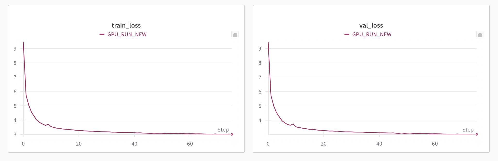

# A little Language Model

A 39M (lil) parameter model trained on ~8B tokens, on 2xA100 for approximately 2 hours. More details below.

## Introduction

> What I cannot create, I do not understand - Richard Feynman

Simply understanding the model architecture is not enough to fully grasp how these models are trained. This project is the outcome of this realization and the frustration on how abstractions limit our learning process (eg. huggingface transformers) at least when we are starting out. The best thing to do is to implement everything from scratch, within minimal abstraction. Well, this is what this project does. With this project, I plan to add everything(code + my notes) from training tokenizers to the post-tranining phases. One may consider it as a roadmap, but it might not be enough and at the end you will have your own roadmap, so just consider it as an outline or introduction to training Large Language Models.

## How to approach this project

Before you approach this project. You should have basic understanding of how transformer model works. A great way to start is by watching and implementing yourself [Karpathy's zero to hero](https://www.youtube.com/watch?v=VMj-3S1tku0&list=PLAqhIrjkxbuWI23v9cThsA9GvCAUhRvKZ) series til part 5. Afterwards, you can take a look at Jay Alammar's [The Illustrated Transformer](https://jalammar.github.io/illustrated-transformer/), and then visit Karpathy's [Let's build GPT: from scratch, in code, spelled out.](https://youtu.be/kCc8FmEb1nY?si=ZyI_mMpGKGfUlkFV). This is just my recommendation, please make sure to visit them in any order as per your need.

Now that you have understanding of the transformers architecture, you're ready to dive deeper this project.

Before anything else, If you're a beginner please start by visualizing how different dimenstional matrix look. Go to this website
https://array-3d-viz.vercel.app and starting from 2D matrix visualize upto 4 dimensional matrix.

### Tokenization

This is the first step in training LM. As LMs can't take text as an input we need to convert text to numbers. We build our own vocabulary to map tokens to numbers. A great way understand the whole concept is to watch karpathy's [Let's build the GPT Tokenizer](https://www.youtube.com/watch?v=zduSFxRajkE&t=3301s). You might need some knowledge about unicode and utf-8 to completely grasp the concept in detail for which you can look at my notes on [Tokenizers](https://cohlem.github.io/sub-notes/tokenization/). In this project, We train huggingface tokenizer (this is the only abstraction that we use) to train our tokenizer. Visit [train_custom_tokenizer.py](https://github.com/CohleM/lilLM/blob/master/train_custom_tokenizer.py) to get into more detail. Since we want our model size to be very small, choosing relatively small vocab_size is important because most of the parameters come from large vocab_sizes. The total vocab_size for our LilLM is 2\*\*13 which includes 16 special tokens.

```
special_tokens = ["<unk>","<s>", "</s>"]
special_tokens = special_tokens + [f'<r{i}>' for i in range(13)]  # total 16 special tokens, 13 reserved for later
```

We add one extra token </s> to each example. The reason behind adding that token is to teach our model when to end generating.

```
you are beautiful
```

```
you are beautiful </s>
```

## Data preparation

The pretraining data will be large. In our case the untokenized data is around ~50GB. The idea is to tokenize all our raw data and save it in a binary file. The reason is tokenization is CPU bound task and we want to maximize our GPU utilization during training by reducing the number of CPU bound task such as the tokenization. We tokenize all our raw data using [process.py](https://github.com/CohleM/lilLM/blob/master/data/pretraining/process.py) save it in binary file and delete our raw dataset because we already know how to encode and decode the those tokenized data using our own tokenizer. The binary file is around 20GB.

## Architecture Implementation

### lilLM Architecture

The architecture differs from transformers architecture in that it uses.

- RMSNorm instead of LayerNorm
- Rotary Positional Embedding instead of Absolute Positional Embedding
- SwiGLU activations instead of ReLU
- Grouped Query Attention instead of Multi-head Attention

Finally, the architecture becomes similar to what is used in Llama 3 models. Find all the code for architecure in [model.py](https://github.com/CohleM/lilLM/blob/master/model/model.py)


| Model      | Download Link                                                         | `vocab_size` | `d_model` | `n_layers` | `max_seq_len` | `q_heads` | `kv_heads` | `max_batch_size` |
| ---------- | --------------------------------------------------------------------- | ------------ | --------- | ---------- | ------------- | --------- | ---------- | ---------------- |
| LilLM-39M  | [Download](https://huggingface.co/jonwondo/lilLM_40M_param_10B_tok)   | `2**13`      | `512`     | `12`       | `512`         | `16`      | `8`        | `32`             |
| LilLM-300M | [Download](https://huggingface.co/jonwondo/lilLM_300M_param_9_5B_tok) | `2**13`      | `1024`    | `24`       | `512`         | `16`      | `8`        | `32`             |

### RMSNorm

Please read this paper [Root Mean Square Layer Normalization](https://arxiv.org/pdf/1910.07467), A simple conclusion from the paper is that we don't need to calculate the mean across layers while performing normalization as we do in Layer Normalization, just maintaining the variation((scaling)) is sufficient, then take a look at `RMSNorm` class.

### Rotary Positional Embedding

Instead of adding extra positional embedding to our token embeddings, we simply rotate our token embeddings. I would first recommend watching this video [RoPE (Rotary positional embeddings) explained](https://www.youtube.com/watch?v=GQPOtyITy54), then read the paper [ROFORMER](https://arxiv.org/pdf/2104.09864) and finally look at my notes on [RoPE](https://cohlem.github.io/sub-notes/rope/) where I explain ROPE with respect to the code that we use in this project. Look at `apply_rotary_pe` function for the implementation

### SwiGLU activations

Take a look at this simple and straightforward blog on [SwiGLU: GLU Variants Improve Transformer (2020)](https://kikaben.com/swiglu-2020/)

### Grouped Query Attention

Instead of using multiple heads in our attention, we simply divide K and V to groups and repeat those K,V to q_heas/kv_heads times, and then perform attention. Why? since K and V are repeated, the data movement within GPU is minimized cause it is the most expensive task and is a bottleneck to our training. To understand better, take a look at this video [Variants of Multi-head attention](https://www.youtube.com/watch?v=pVP0bu8QA2w) and then read my notes on [Grouped Query Attention](https://cohlem.github.io/sub-notes/kv-cache-gqa/). The code is contained in the `Attention` class.

### Weights Initialization

See this section of [weights initialization](https://youtu.be/l8pRSuU81PU?si=23AmsWizoFf7nfIp&t=4437) and see `LilLM` class initialization.

### Distributed Training

Now that the architecture has been completed, you might want to focus on how to train them in distributed manner. First step would be to see Umar Jamil's video on [Distributed Training with PyTorch](https://youtu.be/toUSzwR0EV8?si=Vj7zWI5LuiAcUSNC) and implement what he recommends from scratch and then visit our [pretrain.py](https://github.com/CohleM/lilLM/blob/master/pretrain.py) code.

### FLOPs utilization

After starting pretraining, you might want to look at how your GPUs are being utilized. Find the ratio of FLOPs utilized by FLOPs offered, and try to maximize that. To learn more about FLOPs utilization look at this paper [Training Compute-Optimal Large Language Models](https://arxiv.org/pdf/2203.15556) Appendix F. If you need more elaborated explanation take a look at my notes on [Flops calculation](https://cohlem.github.io/sub-notes/flops-calculation/)

## Training Details

### Tokenizer Training Data

It was trained on 0.1% of [OpenWebText](https://huggingface.co/datasets/Skylion007/openwebtext). Recommended way would be to train the tokenizer on diverse and large dataset to get the best compression rate. For simplicity, I wanted my model to just be able to converse well, I opted for this small subset of the dataset which you can find [here](https://huggingface.co/datasets/CohleM/openweb-800k)

### Pretraining Data

The model was trained [OpenWebText](https://huggingface.co/datasets/Skylion007/openwebtext), which is close to 10 billion tokens according to our tokenizer, but the model was only trained on ~8B tokens (credits ran out :( ).

### Compute

It was trained on 2XA100 for approximately 2.5 hours.

This is the specification of machine that I used. GPU was rented from [Tensordock](https://www.tensordock.com)

| **Category**      | **Details**            |
| ----------------- | ---------------------- |
| **Storage**       | 300 GB                 |
| **vCPUs**         | 40 AMD EPYC 7513 vCPUs |
| **RAM**           | 80 GB RAM              |
| **GPU**           | 2x A100 SXM4 80 GB     |
| **Compute Price** | $2.400000/hour         |
| **Storage Price** | $0.075000/hour         |
| **Total Price**   | $2.475000/hour         |

### Train/Val loss



### Supervised Fine-tuning

After pretraining, the model was trained on 300K examples of data. To construct SFT data mixture we take [magpie-ultra-v1.0](https://huggingface.co/datasets/argilla/magpie-ultra-v1.0) remove math, coding and debugging mixture, limit upto two-turn conversation, and filter out examples greater than 512 tokens using our tokenizer.

We take huggingface's [smoltalk](https://huggingface.co/datasets/HuggingFaceTB/smoltalk) SFT mixture and select these cateogies `'smol-constraints', 'smol-rewrite', 'smol-summarize', 'everyday-conversations', 'explore-instruct-rewriting','openhermes-100k'` and remove other categories. We again filter out examples greater than 512 tokens. Find the final dataset mixture [here](https://huggingface.co/datasets/CohleM/lillm-sft-dataset-512-including-hard-coded-mixture).

We use a different training objective than we did while pretraining. In this fine-tuning process, we only train our model on tokens from "assistant" role. Why? because the training objective is different in fine-tuning, we are doing next token prediction but only for the "assistant" because this is what we want for output so mask out (i.e make zero) tokens other than "assistant" role. Please take a look at 3.1 SupervisedFine-Tuning(SFT) in [Llama2](https://arxiv.org/pdf/2307.09288) paper which explains this procedure.

We use this template for SFT

```
'<r0> user<r1> What is the capital of France?</r2><r0> assistant<r1> The capital of France is Paris. It is the most populous city in the country and serves as the center of French politics, culture, and economy. Located in the north-central part of France, Paris is known for its stunning architecture, famous landmarks such as the Eiffel Tower, and world-class museums like the Louvre.</s>
```

The loss will be calculated only for these tokens

```
The capital of France is Paris. It is the most populous city in the country and serves as the center of French politics, culture, and economy. Located in the north-central part of France, Paris is known for its stunning architecture, famous landmarks such as the Eiffel Tower, and world-class museums like the Louvre.</s>
```

The special tokens don't carry much meaning, only the EOS token i.e </s> is considered for teaching model when to stop, and this is the only special token that takes part in loss calulation.

The model was fine-tuned for close to 4 epochs. We stop when we observe the model is overfitting.


The model was futher fine-tuned on [hard-coded](https://huggingface.co/datasets/CohleM/lillm-sft-hard-coded) examples for some(20-30) steps. Find the code for SFT in [sft_train.py](https://github.com/CohleM/lilLM/blob/master/sft_train.py).

Fine-tuning was done on 1xRTX 4090 for about 1.5 hours. Thanks to [Yuchen Jin](https://x.com/Yuchenj_UW) for providing GPU credits.

## Sample outputs after pretraining

Input

```
Bernie Sanders of Vermont would seek a recount. The delay postponed a definitive answer to whether Clinton had made a clean sweep of five big primaries on
```

Output

```
Bernie Sanders of Vermont would seek a recount. The delay postponed a definitive answer to whether Clinton had made a clean sweep of five big primaries on opening day of the Democratic nominating process.\n\nIn response, Sanders theorized that it was possible for her to then-choice’s hand to escalate into a “unprecedented vote” to take the nomination. However, his standing to refrain from carrying coal companies in the wilderness at the time of her Nov. 8 pick-ing defeat surprised the race.\n\nTrump said Wednesday morning that he will back Clinton to replace the incumbent U.S. senator who ran against Bernie Sanders on Tuesday, in a 33-16 historic win over Hillary Clinton. Though, given that both Hillary Clinton and Bernie Sanders enjoyed a restricted number of fallen out of the race on the set of their Iowa primary
```

Input

```
The latest Marvel movie has shattered box office records, grossing over $1 billion worldwide in just two weeks. Fans have praised the
```

Output

```
The latest Marvel movie has shattered box office records, grossing over $1 billion worldwide in just two weeks. Fans have praised the icons like Roc Nation and Meet The Press for the budgetary ramifications Ain’t Not a breakout promotion.\n\nIn the second week of December, Marvel announced Monday that various Marvel games and Daredevil: The Desolation of holding off it would leave Friday to Evil Geniuses. The Daredevil announced Monday that The Clone Wars is now open and ready for release in late June.
```

## Sample outputs after Supervised Fine-tuning

Input

```
Tell me about yourself.
```

Output

```
I'm LilLM, a little language model developed by open-source contributors at https://github.com/CohleM/lilLM open-source community. I can assist with a variety of tasks, such as answering questions and providing constructive feedback, helping with grammar, style, clarity, and more. Whether you're looking for information, advice, or just a chat, I'm here to help to do my best to provide the best possible guidance.
```

Input

```
Provide a concise, objective summary of the input text in up to three sentences
"""Dear Dr. Kapoor,

I hope this email finds you well. I am reaching out to introduce myself as your collaborator on the AI for Education project. As the lead software developer and UX designer for the project, I am eager to work with you and learn from your expertise in machine learning and adaptive learning systems.

I have reviewed your remarkable work on personalized education using AI and your innovative approaches to improving student engagement. I am confident that your contributions will be instrumental in creating a platform that transforms the educational experience for students globally.

I would love to schedule a meeting with you next week to discuss our respective responsibilities, project timeline, and initial design concepts. Please share your availability, and I will arrange the meeting accordingly.

Looking forward to working with you on this groundbreaking initiative.

Best regards,
Jason Rivera
"""
```

Output

```
Jason Rivera, the lead software developer on the AI for Education project, is reaching out to collaborate on using AI for student engagement. Jason is enthusiastic about the positive impact of personalized education on students' learning. The meeting is scheduled to focus on the technical aspects of the project.
```

Input

```
Your answer must contain exactly 3 bullet points. Use the markdown bullet points such as: * This is point 1. Your response should contain less than 100 words.\n\nWhat are the main advantages of daily exercise?\n
```

Output

```
* Regular exercise helps improve cardiovascular health reducing the risk of heart disease.
* It enhances mental well-being by reducing symptoms and promoting better sleep.
* Regular physical activity boosts energy levels and energy levels.
```

## Quick Start

### Training from Scratch

#### Install dependencies

```
git clone https://github.com/CohleM/lilLM.git
```

```
pip install -r requirements.txt
```

#### Train Tokenizer

I plan to make this more startforward by adding commandline arguments, but for now please follow the steps described

Download the data from [here](https://huggingface.co/datasets/CohleM/openweb-800k) and convert it to jsonl format, open the `train_custom_tokenizer.py` file and replace the file_path with your path/to/your_jsonl_file and then

```
python train_custom_tokenizer.py
```

Tokenizer will be stored in `/model/tokenizer`.

#### Download and Tokenize pretraining data

```
python data/pretraining/process.py --tokenizer_path='/home/user/lilLM/model/tokenizer'
```

Make sure to replace the `tokenizer_path` with correct path

It will download the [OpenWebText](https://huggingface.co/datasets/Skylion007/openwebtext) dataset from huggingface and tokenize the whole dataset using our tokenizer saved in `/model/tokenizer` and save tokenized files as `train.bin` and `val.bin`.These are the binary files for our tokenized dataset. `train.bin` results in ~20GB. The reason for tokenizing it beforehand is because we want to maximize our GPU utilization. Since tokenization is a CPU bound task, we can do it before hand while allowing our GPU train more tokens during training.

#### Pretrain

If you have Nx GPU per node run.

```
torchrun --standalone --nproc_per_node=2 pretrain.py
```

If you only have one GPU run,

```
python pretrain.py
```

Please also take a look at default config parameters in `model/config.py` and in `pretrain.py`

#### Supervised Fine-tuning

Download the pretrained model.

```
python download_model.py --repo_id="jonwondo/lilLM_40M_param_10B_tok" --filename="lilLM_40M_params_10B_tok.pt"
```

Start the training run.

```
python sft_train.py --init_from="resume" --model_path="/home/user/lillm/best_model_15K.pt" --tokenizer_path="/home/user/lillm/model/tokenizer/" --data_path="CohleM/lillm-sft-dataset-v1"
```

#### Inference

Inference can be done using the same file for both supervised fine-tuned model or pretrained model, simply replace the mode_path and the mode_type i.e either "sft" or "pretrain".

```
python inference.py --model_type="sft" --text="What is the capital of Germany?" --model_path="/home/user/lillm/best_model_790_sft.pt"
```

If you want to use chat interface use

```
python inference_gradio.py --model_type="sft" --text="What is the capital of Germany?" --model_path="/home/user/lillm/best_model_790_sft.pt"
```

## TODO

### Post Training Stages

- Finetune using DPO

### Architectural Changes

- Add Mixture of Experts (MoE)

## References

- [Llama3](https://github.com/meta-llama/llama3/blob/main/llama/)
- [nanoGPT](https://github.com/karpathy/nanoGPT)
- [MiniMind](https://github.com/jingyaogong/minimind/)
- [TinyLlama](https://github.com/jzhang38/TinyLlama)
